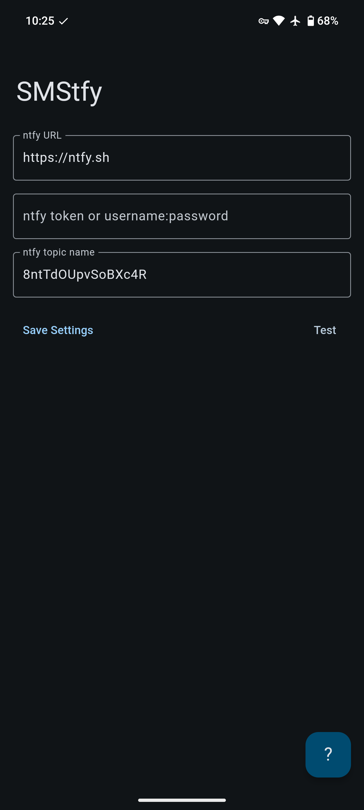

# SMStfy

SMS gateway powered by [ntfy](https://ntfy.sh/).

## Details

When you receive an SMS, SMStfy will send the message data to a ntfy server and topic of your choice.

Note:
- The app must remain open to work.
- The app does not keep a message history (this is left to the ntfy server).
- Errors are reported through notifications, are not stored in the app, and may be partly cut off due to length limitations.
  - Enable Android's 'Notification History' feature to ensure you can access past error messages and read them in their entirety.
- Sending SMS from a ntfy topic subscription is currently not supported.

## Screenshots

|  |  |  |
| ------------------------------------------------------ | ----------------------------------------------------------------------- | -------------------------------------------------------------------- |